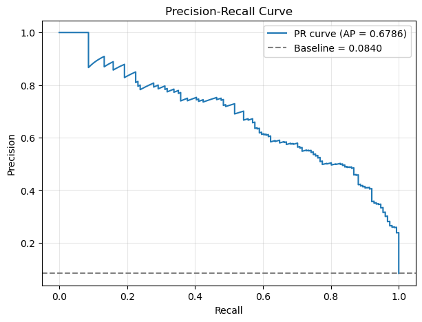
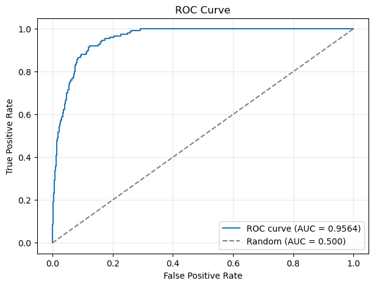
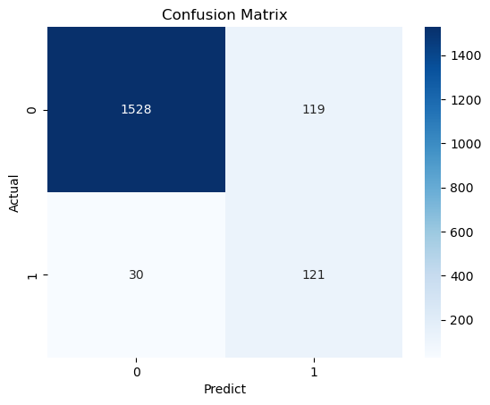
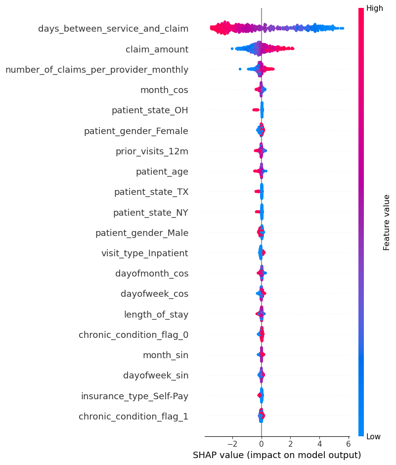

# Healthcare Fraud Detection with PyTorch

## Project Overview
* **Objective:** Develop a deep learning classification pipeline to flag potentially fraudulent healthcare insurance claims, helping insurance companies minimize financial losses and streamline claims processing.
* **Data Cleaning:** Removed rows with missing values, dropped high-cardinality identifiers, and eliminated post-decision leakage features to ensure the model reflects a realistic operating scenario.
* **Model Building & Feature Engineering:** Engineered time-based features using cyclical encoding, applied Yeo-Johnson scaling for numeric variables, and built a PyTorch Feed-Forward Neural Network optimized with early stopping and class-weighting to handle the highly imbalanced dataset.
* **Model Performance:** My tuned neural network achieved a PR-AUC of 0.68 (an 8x lift over the baseline) and an ROC-AUC of 0.96, effectively capturing 80% of fraudulent claims at a 50% precision rate.

## Objective
My goal for this project was to build a robust deep learning model capable of accurately detecting fraudulent healthcare insurance claims from imbalanced tabular data. By accurately flagging these potentially fraudulent claims, insurance providers can significantly reduce financial leakage, lower healthcare costs for consumers, and focus their investigative resources on the most suspicious cases. The value created by this project lies in providing a leak-free, highly interpretable machine learning pipeline that makes deliberate trade-offs to favor catching fraud over minimizing false alarms, ultimately saving money and improving operational efficiency.

## Resources Used
* **Data Source:** [Healthcare Fraud Detection Dataset (Kaggle)](https://www.kaggle.com/datasets/nudratabbas/healthcare-fraud-detection-dataset)
* **Libraries & Packages:** `kagglehub`, `pandas`, `numpy`, `matplotlib`, `seaborn`, `scikit-learn`, `feature_engine`, `torch`, `shap`

## Project Features Explanation
Below is a list and explanation of every single variable present in the initial dataset:
* **provider_id:** Unique identifier for the healthcare provider.
* **claim_id:** Unique identifier for the medical claim.
* **patient_age:** The age of the patient receiving the service.
* **patient_gender:** The gender of the patient.
* **diagnosis_code:** Medical code representing the patient's diagnosis.
* **procedure_code:** Medical code representing the procedure performed.
* **claim_amount:** The total monetary amount requested for the claim.
* **approved_amount:** The monetary amount that was actually approved for the claim.
* **insurance_type:** The type of insurance covering the patient (e.g., Medicare, Private, Medicaid).
* **claim_submission_date:** The specific date when the claim was submitted.
* **days_between_service_and_claim:** The number of days elapsed between the medical service and the submission of the claim.
* **number_of_claims_per_provider_monthly:** The total number of claims submitted by the specific provider during that month.
* **provider_specialty:** The specialized medical field of the provider (e.g., Cardiology, General Practice).
* **patient_state:** The US state where the patient resides.
* **claim_status:** The current status of the claim (e.g., Approved, Rejected, Pending).
* **is_fraud:** The target variable indicating whether the claim is fraudulent (`1`) or not (`0`).
* **length_of_stay:** The duration of the patient's stay at the medical facility, in days.
* **visit_type:** The classification of the visit (e.g., Emergency, Outpatient, Inpatient).
* **chronic_condition_flag:** A binary indicator of whether the patient has a diagnosed chronic condition.
* **prior_visits_12m:** The number of prior medical visits made by the patient in the last 12 months.

## Data Cleaning
To prepare the dataset for my deep learning model, I performed several essential data cleaning and preprocessing steps:
* Converted the `claim_submission_date` from a string to a proper datetime format.
* Cast the `chronic_condition_flag` to a string type for categorical processing.
* Identified and completely removed all rows containing missing values (nulls) to maintain data integrity.
* Dropped high-cardinality identifier columns (`provider_id`, `claim_id`, `diagnosis_code`, `procedure_code`) that would not generalize well.
* Crucially, I removed the `claim_status` and `approved_amount` features to prevent target leakage, as these are post-decision variables not available at the time of claim submission.

## Model Building & Feature Engineering
Before training the model, I focused on robust feature engineering to handle the diverse data types and temporal aspects of the dataset:
* Extracted `weekend`, `dayofweek`, `dayofmonth`, and `month` components from the `claim_submission_date`.
* Applied Cyclical Encoding to the time-based features (`dayofweek`, `dayofmonth`, `month`) using sine and cosine transformations to preserve their continuous, circular nature.
* Used One-Hot Encoding for all nominal categorical variables (`patient_gender`, `insurance_type`, `provider_specialty`, etc.).
* Standardized and transformed all numerical features using the Yeo-Johnson Power Transformer to handle skewness.
* Carefully applied these transformations via a scikit-learn pipeline, fitting only on the training set to prevent data leakage.

For the modeling phase, I built a PyTorch Feed-Forward Neural Network consisting of:
* **Hidden Layers:** Two hidden layers (64 and 32 neurons) incorporating Batch Normalization, ReLU activation, and Dropout layers to prevent overfitting.
* **Output Layer:** A single linear output node.
* **Loss Function:** `BCEWithLogitsLoss` equipped with a calculated positive-class weight to directly tackle the extreme class imbalance (~8% fraud).
* **Training & Tuning:** I trained the network using the Adam optimizer and implemented early stopping based on the validation loss. I also ran a grid search to find the optimal learning rate, class-weighting mode, and dropout rates. Finally, I used SHAP (DeepExplainer) to interpret global feature importance.

## Model Performance
I evaluated my model using PR-AUC (Average Precision) as the primary metric, since it is the most appropriate measure for highly imbalanced datasets.
* The optimized Feed-Forward Neural Network achieved a **PR-AUC of 0.68**, representing a significant (~8x) lift compared to the baseline positive rate of 0.08.
* The model also achieved an impressive **ROC-AUC of 0.96**.
* By tuning the decision threshold on the validation set, I optimized the model to maximize recall while keeping precision at or above 0.5. At this threshold, my model successfully catches **80% of all fraudulent claims** (Recall = 0.80) with a 50% precision rate. This performance makes the Neural Network my optimal choice, as it aligns perfectly with my strategic goal of heavily favoring fraud detection over minimizing false alarms.

## Feature Importance
To ensure the model is interpretable and transparent, I utilized **SHAP** with a `DeepExplainer` to evaluate the global feature importance of the neural network. This analysis helps identify which variables are the strongest drivers in flagging a claim as fraudulent.

Based on the SHAP analysis, the top three most influential features in detecting fraud are:
1. **`days_between_service_and_claim`**: This is by far the strongest predictor. Shorter delays between the service date and the claim submission date are highly associated with a greater risk of fraud.
2. **`claim_amount`**: Higher monetary claim amounts significantly increase the likelihood of the claim being flagged as fraudulent.
3. **`number_of_claims_per_provider_monthly`**: Providers submitting a higher volume of claims in a given month are more likely to be associated with fraudulent claims.

These insights confirm that the model relies on intuitive, logical patterns—such as rapid, high-value submissions from high-volume providers—to identify potential fraud.

